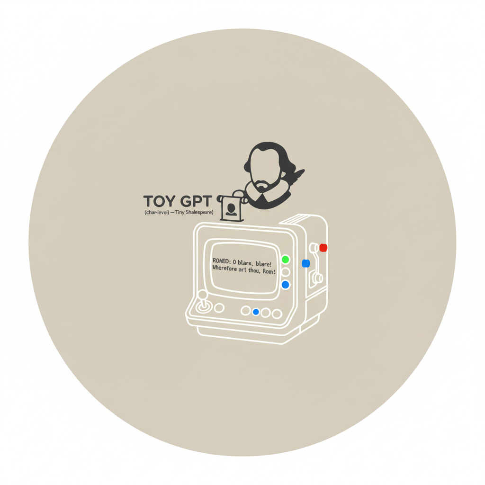

# Toy GPT (char-level) — Tiny Shakespeare 

This repo is a clean project skeleton that packages your provided PyTorch code
into a small, reproducible project structure. It trains a tiny Transformer
(char-level) on the Tiny Shakespeare dataset and generates text.

> **Reported result:** `train loss 1.6604, val loss 1.8520`

## Features

- Minimal char-level tokenizer (no external deps)
- Tiny GPT-style model (multi-head self-attention, residuals, LayerNorm)
- Simple training loop with AdamW
- Periodic train/val loss estimates
- Checkpoint saving
- Text generation script
- Tiny dataset download helper

## Project structure

```
toy-gpt-char/
├── README.md
├── .gitignore
├── requirements.txt
├── pyproject.toml
├── src/
│   └── toygpt/
│       ├── __init__.py
│       ├── data.py
│       ├── ensure_data.py
│       ├── generate.py
│       ├── metrics.py
│       ├── model.py  
│       └── train.py
├── tests/
│   └── test_model_forward.py
├── scripts/
│   └── download_data.py
├── data/
│   └── input.txt           # downloaded by the script
└── checkpoints/
    └── (saved .pt files)
```

## Quickstart

### 1) Create a virtual environment (recommended)

```bash
python -m venv .venv
source .venv/bin/activate   # Windows: .venv\Scripts\activate
pip install --upgrade pip
```

### 2) Install deps

```bash
pip install -r requirements.txt
pip install -e .
```

> If you're on a CUDA machine, install the appropriate `torch` build for your GPU.
> CPU works fine too—just slower.

### 3) Download the dataset

```bash
python -m toygpt.ensure_data   # or: python scripts/download_data.py
```

This will place `data/input.txt` (Tiny Shakespeare) into the `data/` folder.

### 4) Train

```bash
python -m toygpt.train
```

By default it runs for 5100 iterations and prints losses every 300 steps. A checkpoint is saved to `checkpoints/ckpt.pt` at the end of training.

> Want a quick sanity sample after training? Append `--sample` to generate text immediately:
>
> ```bash
> python -m toygpt.train --sample
> ```

> Need to keep training? Use `--resume` to pick up from the latest checkpoint and optionally pass `--steps` to control how many additional optimization steps to run (defaults to 5000 per invocation):
>
> ```bash
> python -m toygpt.train --resume --steps 2000
> ```

> **Expected (reported) final losses:** `train loss 1.6527, val loss 1.8550`  
> Exact numbers can vary slightly by hardware/seed.

### 5) Generate text

```bash
python -m toygpt.generate --max-new-tokens 500
```

You can also generate without training first; the script will load a checkpoint if available and fall back to the freshly initialized model otherwise.

## Pushing to GitHub

```bash
git init
git add .
git commit -m "Init toy-gpt-char"
git branch -M main
git remote add origin https://github.com/<your-username>/toy-gpt-char.git
git push -u origin main
```

## Hyperparameters (defaults)

- `batch_size = 32`
- `block_size = 16`
- `max_iters = 5100`
- `eval_interval = 300`
- `learning_rate = 1e-3`
- `eval_iters = 200`
- `n_embd = 384`
- `n_layer = 4`
- `n_head = 6`
- `dropout = 0.2`
- `device = "cuda" if available else "cpu"`
- `seed = 1337`

All of the above are encoded directly in `toygpt/train.py` and `toygpt/model.py` for simplicity.

## Notes

- The model is intentionally small. It's great for learning and quick experiments.
- Results depend on randomness, device type (CPU/GPU), PyTorch version, and CUDA/cuDNN kernels.
- For longer sequences or better quality, raise `block_size`, `n_layer`, and `n_embd`, and train longer.
- The `feature/heads-parallel` branch keeps the alternative attention implementation handy; checkout that branch if you want to experiment with the multi-head refactor before it lands in `main`.
